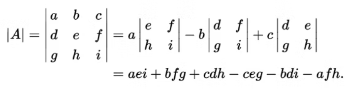
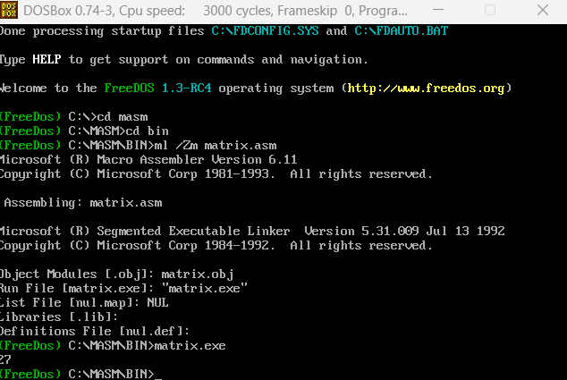

# x86 Assembly: Recursive Matrix Determinant Calculator

This repository contains a high-performance implementation of a **Recursive Determinant Calculator** for square matrices, developed during my Computer Engineering studies at Bar-Ilan University. The program computes the determinant using the **Laplace Expansion** method and supports signed arithmetic.

### Algorithm Visualization
The calculation follows the recursive minor expansion formula, where an $N \times N$ matrix is broken down into $(N-1) \times (N-1)$ sub-matrices (minors):



### Key Technical Achievements
* **Advanced Recursive Logic:** Implements a robust recursive engine to handle matrix reduction from $N \times N$ down to a $2 \times 2$ base case.
* **Memory Management:** Efficiently utilizes a dedicated `MINOR_BUF` for dynamic storage and retrieval of minor matrices during deep recursive calls.
* **16-bit Signed Arithmetic:** Engineered to handle both positive and negative integers, including a custom `PrintDet` procedure designed for signed output.
* **Low-Level Optimization:** Optimized register usage (SI, DI, BP) to minimize memory overhead and ensure stability within the DOS environment.



---

### Technical Details
* **Language:** x86 Assembly (MASM)
* **Target Environment:** DOSBox / FreeDOS
* **Key Procedures:**
    * `getMinor`: Dynamically generates minor matrices by excluding specific rows and columns based on the current recursive step.
    * `calcDet`: The core recursive function that manages the stack frame and accumulates the determinant sum.
    * `PrintDet`: A custom I/O handler for displaying signed 16-bit results on the DOS console.

### How to Build and Run
To assemble and link the source files in a DOS environment:

1. **Assemble and Link:**
   ```bash
   ml /Zm matrix.asm
2. **Execute:**
   ```bash
   matrix.exe  
